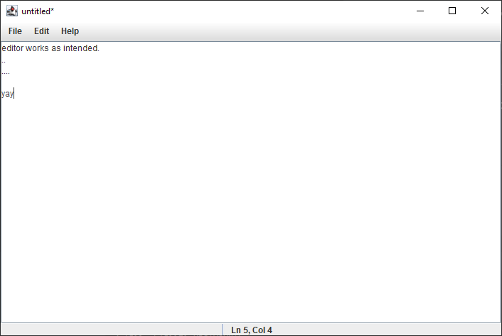
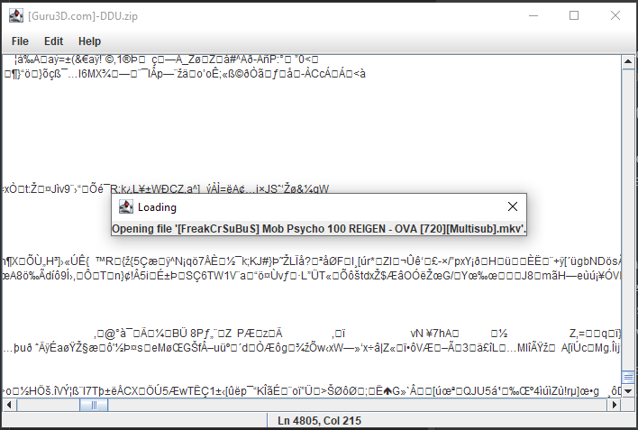

# CSE406 – CA2
> Jaideep Singh Heer
---

### Question
Design a GUI based Text-editor such that it provided the options to create new file and
open existing file.

1. When new file is created then provide the editable area to compose the text and the
provide the option to save.
Make sure that user can select the destination (directory) for the file to be saved and name
and extension of the file.
E.g: User can create a file and save it with name `mydoc.txt` or `mydoc.doc` or `mydoc.pdf` in
any directory.

2. When user wants to open existing file then facilitate the user to select the file using
`JFileChooser` and
display its contents in the editable area. Allow the user to update the file and then provide the
option to save and save as (`txt` `pdf` `doc`).

> Use JFileChooser for browsing the File and Directory and Java NIO for dealing with
file system. 

### Program Description
The given program is written in Java 8.
It provides a GUI with a editable `JTextArea`, a menu bar and a status bar.

The program uses a custom implementation of the [`bloc`](./src/main/java/bloc_lib/Bloc.java) pattern to separate GUI handling from the state management.
The [`bloc`](./src/main/java/bloc_lib/Bloc.java) pattern is implemented in the classes in the [`/src/main/java/bloc_lib`](./src/main/java/bloc_lib) directory.

The logic to generate and handle the main GUI can be found in the [`TextEditor.java`](./src/main/java/TextEditor.java) file. 

The `bloc` handling saving/loading and managing file state is implemented in [`fileevent_bloc`](./src/main/java/blocs/fileevent_bloc) folder.
This `bloc` accepts a [`FileEvent`](./src/main/java/blocs/fileevent_bloc/FileEvent.java) and emits a [`FileState`](./src/main/java/blocs/fileevent_bloc/FileState.java) to its registered [`StateListeners`](./src/main/java/bloc_lib/StateListener.java).

To learn more about the `bloc` pattern, visit this [repo](https://github.com/felangel/bloc/tree/master/packages/bloc).

## Run The Program

Java 1.8 installation is required to run the program.
You can install Java 8 from [AdoptOpenJDK.net](https://adoptopenjdk.net/?variant=openjdk8&jvmVariant=openj9).

To run the program,
 - Download the `SwingTextEditor-*.zip` or the `SwingTextEditor-*.tar` file from the [releases](/releases) page.
 - Extract the zip file to wherever you like and open the `SwingTextEditor-*` folder.
 - On windows, double click the `./bin/SwingTextEditor.bat` file.
 - On linux/MAC, run the `./bin/SwingTextEditor` file.
 
You can also download the `SwingTextEditor-*.jar` and run it directly using the command,
> `java -jar SwingTextEditor-*.jar`

Remember to use the correct file name in place of `SwingTextEditor-*.jar` depending on the version you downloaded.
 
 
## Screenshots

##### Editor Window

##### Opening File
